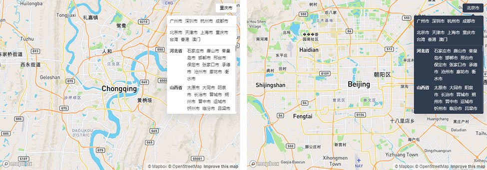

# City Selector Control
Adds a City Selector Control to `mapbox-gl`

## Installation:

```bash
npm i cityselector-control
```

## Usage:

```javascript
new CitySelectControl(options: Object)
```

### Options:
|#|Name|Type|Description|Default|
|---|---|---|---|---|
|1|`theme`|`String `|Theme, optional `'light'` or `'dark'`.|`'light'`|
|2|`placeholder`|`String`|The initialized text.|default `'请选择'` |
|2|`hot`|`Array`|The Code for hot cities.|default `['440100', '440300', '330100', '510100']` |
|2|`zoom`|`Number`|The desired zoom level.|default `10` |

### Example

```javascript
import CitySelectorControl from 'cityselector-control'
import 'cityselector-control/src/style.css'
// default options
map.addControl(new CitySelectControl(), 'top-right')

// custom options
const citySelectorOptions = {
  theme: 'dark',
  placeholder: '全国',
  hot: ['110000', '340500'],
  zoom: 10
};
map.addControl(new CitySelectControl(citySelectorOptions), 'top-right');
```

## Screenshots:




